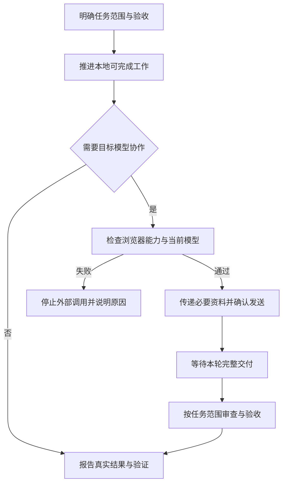

# gpt-thinking-pro-collab

让 Codex 通过内置浏览器与 GPT-6 Astra Pro 协作处理工程咨询、审计和实现。Codex 负责任务边界、本地接入与真实验证；简单任务可以直接完成，疑难问题再向目标模型求助。

显式入口：`$gpt-thinking-pro-collab`。唯一目标为 `GPT-6 Astra Pro`，兼容 `GPT-6 Pro` / `6 Pro`；不自动触发、不切换到其他模型、不自动降级。

[快速开始](#快速开始) · [使用示例](#使用示例) · [运行流程](#运行流程) · [故障处理](#故障处理) · [安装与更新](#安装与更新) · [维护与验证](#维护与验证)

## 快速开始

### 1. 确认环境

- Codex Desktop 的当前工具 / 插件目录中提供内置浏览器；Codex 会读取实际提供者的操作指南，无须依赖固定的浏览器 Skill 名称。
- 用户可在该浏览器中登录 ChatGPT，并在当前对话选择目标模型。认证由用户完成，Skill 不读取凭据。
- 使用下列 Skills CLI 1.7.0 命令需要 Node.js `>=22.20.0` 与 Git。归档 / 补丁助手另需 Python 3.10+，无第三方运行时依赖。[CLI 版本要求](https://github.com/vercel-labs/skills/blob/main/package.json)
- 项目允许把本任务必要的资料提供给 ChatGPT；Codex 能读取仓库并执行已授权的验证。

### 2. 安装并确认可发现

已有同名 Skill 时，先按[更新说明](#更新)核对来源和本地定制内容。

```bash
npx skills@1.7.0 add jay6697117/gpt-thinking-pro-collab-skill \
  --skill gpt-thinking-pro-collab -g -a codex -y
npx skills@1.7.0 list -g -a codex
```

列表应包含 `gpt-thinking-pro-collab`。安装后新建一个 Codex 任务，输入完整的 `$gpt-thinking-pro-collab`。自然语言用于描述已加载 Skill 的需求，不能保证在未显式调用时自动加载。

GitHub 命令安装远端已发布版本；试用尚未发布的 checkout，见[本地与手动安装](#本地与手动安装)。

### 3. 发出任务

```text
$gpt-thinking-pro-collab
需求：修复快速切换列表筛选条件时产生的重复请求。
```

默认 `consult`：Codex 先工作，需要时才咨询。省略验收标准时，Codex 从仓库规则、测试和风险补全。完成后应看到实际结果、验证与限制；未咨询时会说明原因，不会把未使用的模型门禁报告为失败。

## 使用示例

### 让目标模型主写实现

```text
$gpt-thinking-pro-collab
模式: delegate
需求：拆分支付回调中的签名校验、幂等处理与业务编排。
验收：保持现有协议兼容；拒绝非法签名；重复回调不重复执行业务；通过相关测试。
```

目标模型提供候选补丁，Codex 检查基线、聚焦审查并本地验证。`delegate` 不自动授权提交、推送、部署或真实数据迁移。

### 只读审计

```text
$gpt-thinking-pro-collab
模式: delegate
需求：请目标模型主写架构审计报告，列出证据、影响和优先级。
范围：只审阅，不修改任何源码。
```

任务类型与协作模式相互独立。只读审计交付报告，选择 `delegate` 不会转成代码修改。

### 指定模型或使用自然语言

```text
$gpt-thinking-pro-collab
模型：6 Pro
需求：请按 consult 模式分析并发调度中的失败恢复路径，先给方案。
```

`模型` / `model`、`模式` / `mode` 均支持，中文或英文冒号均可。模型仅接受以下三个精确值：

| 配置值 | 归一化目标 | 当前 UI 门禁 |
| --- | --- | --- |
| `GPT-6 Astra Pro`、`GPT-6 Pro`、`6 Pro` | `GPT-6 Astra Pro` | 已选完整标签，或同时已选 `GPT-6 Astra` 与 `Pro` |

仅去掉两侧空白，不改大小写或内部空格。多个别名指向同一目标时合并；空值、未知值、冲突值失败，不能由合法值覆盖非法值。`6-pro`、GPT-5.6 系列等旧值不再支持。完整规则见[配置说明](skills/gpt-thinking-pro-collab/references/configuration.md)。

## 运行流程


```mermaid
flowchart TD
    TASK["明确任务范围与验收"] --> LOCAL["推进本地可完成工作"]
    LOCAL --> NEED{"需要目标模型协作"}
    NEED -->|"否"| REPORT["报告真实结果与验证"]
    NEED -->|"是"| GATE["检查浏览器能力与当前模型"]
    GATE -->|"通过"| CHAT["传递必要资料并确认发送"]
    GATE -->|"失败"| BLOCK["停止外部调用并说明原因"]
    CHAT --> WAIT["等待本轮完整交付"]
    WAIT --> REVIEW["按任务范围审查与验收"]
    REVIEW --> REPORT
```

当前对话选择器已选中的完整 `6 Pro` 可直接通过门禁，不必展开菜单或先问“你是什么模型？”。引用、旧截图、聊天正文及未选中的选项不能替代当前选择证据。每次恢复、继续发送或采纳回复前复核；证据不足、冲突、额度回退或不可用时停止本次调用，不重选或换模型重试。

长时间推理可以持续 30 分钟到 1 小时以上，经过时间本身不是失败。发送结果未知时先核对原对话，避免重复提交；只有与本轮请求对应的完整回复才进入验收。

目标模型自查不计为独立审核，哈希一致不证明代码正确。Codex 检查真实改动、权限和兼容性并运行本地验证；已有可信独立审核只在身份、版本与范围匹配时复用。详见[浏览器与恢复](skills/gpt-thinking-pro-collab/references/browser-workflow.md)、[审查与交付](skills/gpt-thinking-pro-collab/references/review-delivery.md)。

## 故障处理

| 现象 | 处理 |
| --- | --- |
| 安装成功但不能调用 | 确认安装列表、目标 agent 与目录；新建任务并显式输入完整调用名 |
| 不清楚加载了哪份 Skill | 查看本次加载的文件路径；区分 CLI 管理副本、符号链接和手动目录，先比对再更新 |
| 内置浏览器不可用 | 在当前宿主启用提供内置浏览器的能力，并提供其实际操作指南；不会改用外部浏览器 |
| 要求登录或验证码 | 用户在内置浏览器完成，明确告知就绪后恢复原任务 |
| 模型门禁失败 | 核对期望与当前已选标签、套餐、额度和模型可用性；本次调用终止，不自动降级 |
| 自动上传不可用 | 按任务标识分批提供必要文本；只有附件不可替代时才请求手动上传 |
| 发送后工具超时 | 原链接核对本轮用户消息；超时不代表发送失败，不直接重发 |
| 补丁基线与本地不一致 | 保留用户修改，核对漂移与重叠范围；重新给出正确资料和候选补丁，不强制覆盖 |

页面和候选交付都不能扩大权限。凭据、浏览器状态、数据库及不允许外发的资料不发送；已有授权无需反复确认，新增副作用需要对应授权。完整[上下文规则](skills/gpt-thinking-pro-collab/references/context.md)与[报告格式](skills/gpt-thinking-pro-collab/references/reporting.md)按需读取。

## 安装与更新

### 本地与手动安装

在当前 checkout 安装这一版（会更新全局同名 Skill，先保护本地定制）：

```bash
npx skills@1.7.0 add ./skills/gpt-thinking-pro-collab \
  --skill gpt-thinking-pro-collab -g -a codex -y
```

手动安装只复制 `skills/gpt-thinking-pro-collab/`，包含 SKILL、agents、references、assets 和 scripts。放到实际 Codex Skill 目录中，默认是 `~/.codex/skills/gpt-thinking-pro-collab/`；设置了 `CODEX_HOME` 时使用该位置。不要把整个仓库克隆成 Skill 目录，也不要只复制 SKILL 而漏掉引用文件。

### 更新

CLI 安装：先核对实际目录、来源与本地定制文件，再更新目标技能：

```bash
npx skills@1.7.0 update gpt-thinking-pro-collab -g -y
```

手动安装：在独立 checkout 更新源码，比对后替换完整的技能子目录。保留本地定制的备份，不对安装副本盲目执行 `git pull`。更新后新建任务，重新核对实际加载位置。

### skills.sh 目录状态

[技能页](https://skills.sh/jay6697117/gpt-thinking-pro-collab-skill/gpt-thinking-pro-collab)已存在。2026-09-28 的后续核查已在公开页面和下载快照中观察到 GPT-6 Astra Pro，下载包仍采用原来的 8 文件结构；本轮未发布的 12 文件版本须在发布后重新核对。历史背景见[重索引事项 #2321](https://github.com/vercel-labs/skills/issues/2321)。

目录出现、安装成功或遥测被接收都不证明内容已更新。发布验证比较实际文件及哈希，不只检查 HTTP 状态。

## 维护与验证

唯一可安装目录是 `skills/gpt-thinking-pro-collab/`；仓库级 README、测试、CI、规划与历史记录不进入技能安装包。

```bash
python3 -m venv .venv
.venv/bin/python -m pip install -r requirements-dev.txt
.venv/bin/python -B scripts/check.py
```

统一检查包含 Skill / YAML 结构、引用、模型白名单、模板残留、包清单、工具行为测试以及 Ruff lint / format。也可使用 `uv run --no-project --with-requirements requirements-dev.txt python -B scripts/check.py`。

```bash
python3 -B scripts/package_skill.py --output /tmp/gpt-thinking-pro-collab.zip
python3 -B scripts/verify_distribution.py --installed /path/to/installed/skill
python3 -B scripts/verify_distribution.py --github-ref main --catalog
```

最后一条命令只读取公开内容；未发布的本地改动或过期目录会明确报告差异并返回非零，不自动提交、推送或触发重索引。

静态检查和脚本测试不证明真实 ChatGPT 账号端到端可用。声明式流程另用保存的合成场景进行独立评估；验证方式、安装验收和 CI 说明见[维护指南](docs/maintenance.md)。

本项目参考 [genoooool/gpt-pro-collab-skill](https://github.com/genoooool/gpt-pro-collab-skill) 的角色分工与本地验收流程，保留规范调用名与当前严格模型门禁。
